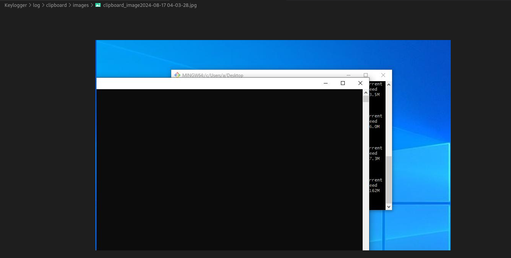
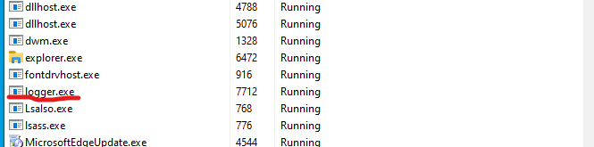

# A simple Keylogger bypass Microsoft Window Defender

A simple Keylogger written in C++, and listening server written in Python.
Keylogger will capture any press keystroke (note that I just concentrate on key which can display):
- Normal key: a,b,c,1,2,3,...
- Some special char like , . ; { } ` ....
- Characters cannot be displayed like [ENTER] [ALT] [BACKSPACE]
and also capture the latest record on clipboard comprising of images or text.
All data will save on memory and deliver to remote specified machine instead of creating log file on local victim machine.

## I. Installation

- ***Mingw***:
    *note that I try to use Microsoft Visual Studio to build exe but I got a lot of errors with lib and header file, you can use MVS if you want, or install Mingw like me*

```bash
sudo apt-get update
sudo apt-get install mingw-w64 -y
```
## II. Usage
### 1. Build virus
***Note:*** *Inspect source in virus.cpp and change sourceip and port to your remote server that hosts server.py (receive shell from victim) then build it using mingw*
```bash
x86_64-w64-mingw32-g++ -o logger.exe mainkeylogger.cpp -static-libgcc -static-libstdc++ -luser32 -lwininet
```

### 2. Run listening server
***Note:*** *This server.py will listen incomming POST request, log any data to log folder*
```python
python3 server.py
```

**Server**:



**Client**



## III. Contributing

- Pull requests are welcome. For major changes, please open an issue first
to discuss what you would like to change.
- Please make sure to update tests as appropriate.
## IV. Disclaimer
- There is no clean code, no penetration test provided, this repo is only for educational purposes. If you got trouble with this, please contact me.